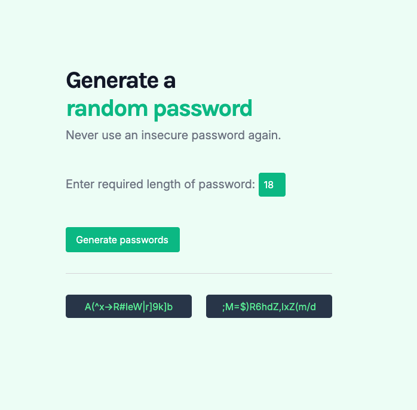

# 🔐 Password Generator

A secure password generator built using **HTML5**, **CSS3**, and **Vanilla JavaScript** as part of my frontend development learning journey.

The application generates strong random passwords instantly with an adjustable password length, helping users create secure credentials for their online accounts.

---

## 📸 Preview

---

## ✨ Features

- Generate strong random passwords
- Adjustable password length
- Instant password generation
- Clean and modern UI
- Built from a Figma design

---

## 🛠️ Built With

- HTML5
- CSS3
- Vanilla JavaScript
- Flexbox
- Figma

---

## 💡 JavaScript Concepts Used

- Variables
- Functions
- Arrays
- Loops
- Random number generation (`Math.random()`)
- DOM manipulation
- Event handling
- String manipulation

---

## 📚 What I Learned

While building this project, I practiced:

- Generating random values in JavaScript
- Creating reusable functions
- Dynamically updating the DOM
- Handling user interactions
- Working with the Clipboard API
- Building a configurable UI using JavaScript
- Translating a Figma design into a functional web application

---

## 🎯 Project Goal

The objective of this project was to strengthen my JavaScript fundamentals by building a practical utility that demonstrates DOM manipulation, event handling, dynamic content generation, and user interaction.

---

## 👨‍💻 Author

**Ashish Bargaje**

- GitHub: https://github.com/ashishbargaje
- LinkedIn: https://www.linkedin.com/in/ashish-bargaje/